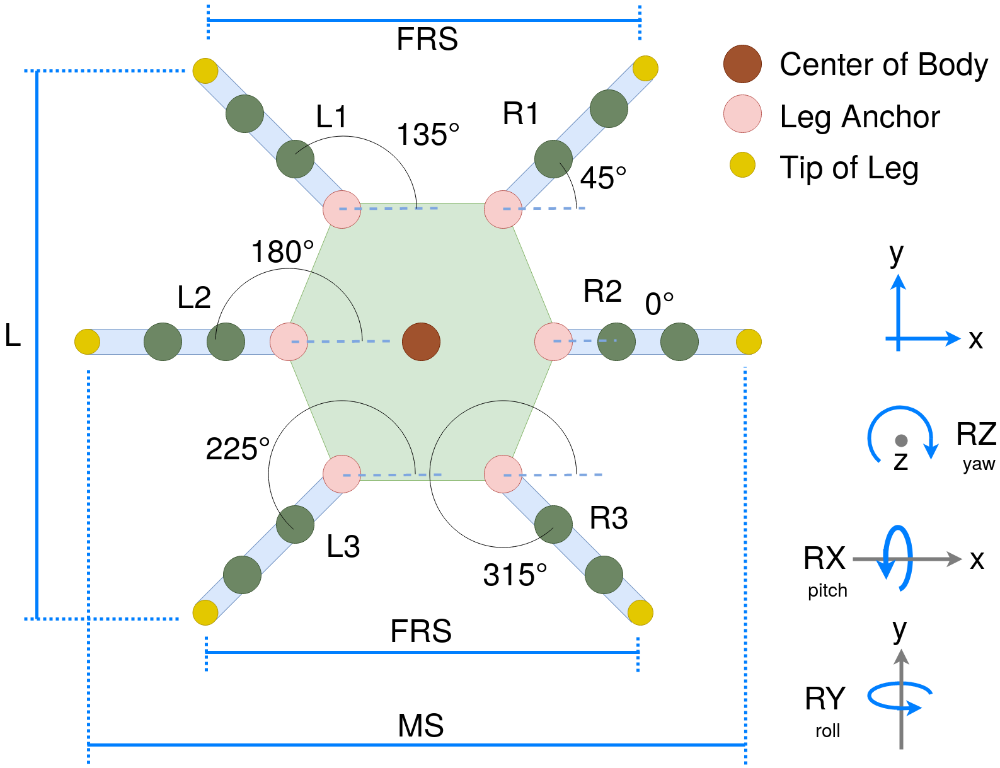
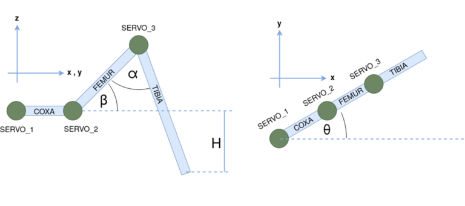

# Definitions

| Index | Leg | Servo   | Axis | Frame | Angle |
| ----- | --- | ------- | ---- | ----- | ----- |
| 0     | L1  | SERVO_1 | X    | COXA  | TETA  |
| 1     | R1  | SERVO_2 | Y    | FEMUR | BETA  |
| 2     | L2  | SERVO_3 | Z    | TIBIA | ALPHA |
| 3     | R2  |         |      |       |       |
| 4     | L3  |         |      |       |       |
| 5     | R3  |         |      |       |       |
